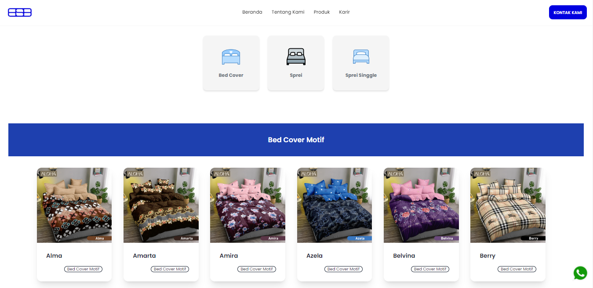

# BSB Textile Distribution - Company Profile Website

Welcome to the BSB Textile Distribution's Company Profile website!

## About Us

BSB Textile Distribution is a leading company in the textile distribution industry. We specialize in providing high-quality textile products to meet the diverse needs of various industries and renowned brands worldwide. With years of experience in the field, we take pride in being a trusted partner for all your textile distribution requirements.

## Key Features

- **Cutting-Edge Technology**: Our website is built using the latest technologies, including React.js, Tailwind CSS, and Swiper.js. This ensures a smooth and interactive user experience.

- **Responsive Design**: Our website is fully responsive and optimized for all devices, allowing you to access our services seamlessly from desktops, tablets, or smartphones.

- **Extensive Textile Collection**: Browse through our vast collection of luxurious and functional textiles. We offer a wide range of fabrics to cater to your specific needs.

- **User-Friendly Navigation**: Our website's intuitive navigation makes it easy to explore our products and services, ensuring a pleasant browsing experience.

## How to Use

1. Clone the repository: `git clone https://github.com/BSB-Textile-Distribution/website.git`

2. Install dependencies: `npm install`

3. Run the development server: `npm start`

4. Open your browser and visit: `http://localhost:3000`

## Contributing

We welcome contributions from the community. If you find any issues or have suggestions to enhance our website, feel free to create a pull request.

## Contact Us

If you have any questions or inquiries, please don't hesitate to contact our team at [contact@bsbtextiledistribution.com](mailto:contact@bsbtextiledistribution.com).

Thank you for visiting our website! We look forward to serving your textile distribution needs.
